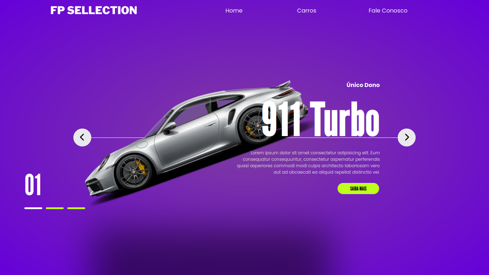

# fb-sellection

## Sumário

- [fb-sellection](#fb-sellection)
  - [Sumário](#sumário)
  - [Motivação](#motivação)
  - [Galeria](#galeria)

## Motivação

Este projeto é um site demonstrativo para uma concessionária fictícia chamada **FB Sellection**, desenvolvido usando HTML, CSS e JavaScript puro. Embora a estilização utilize a notação de aninhamento (`nesting`) diretamente em arquivos `.css`, o site não emprega Sass ou Less. Em vez disso, o ambiente de desenvolvimento está configurado com um pré-processador que converte o código CSS em tempo real, o que facilita a sintaxe aninhada. No entanto, isso implica que, ao rodar o projeto em máquinas sem essa configuração, a renderização de estilos pode não funcionar corretamente.

Na parte visual, o CSS segue uma estrutura escalável, com animações para listas e transições de abertura de elementos, trazendo uma experiência interativa suave e envolvente. Inspirado na arquitetura _Model-View-Controller_ (MVC), o projeto mantém funções bem definidas entre seus arquivos: o HTML serve como base estrutural dos elementos, o CSS se dedica exclusivamente à apresentação e transições, e o JavaScript cuida das interações. Por exemplo, o código JavaScript altera dinamicamente a classe `.active` entre os itens de uma lista para atualizar o destaque visual:

```html
<ul>
  <li id="carro-1"></li>
  <li id="carro-2" class="active"></li>
  <li id="carro-3"></li>
</ul>
```

Esse modelo permite uma organização modular e eficiente, onde cada componente cumpre seu papel no comportamento do site, criando um fluxo de código coeso e sustentável.

Este repositório de código foi apresentado no [Curso Superior de TSI do IFMS](https://www.ifms.edu.br/campi/campus-aquidauana/cursos/graduacao/sistemas-para-internet/sistemas-para-internet) para auxiliar um discente nas atividades do Programa de Monitoria da unidade curricular Linguagem de Programação I.

## Galeria

